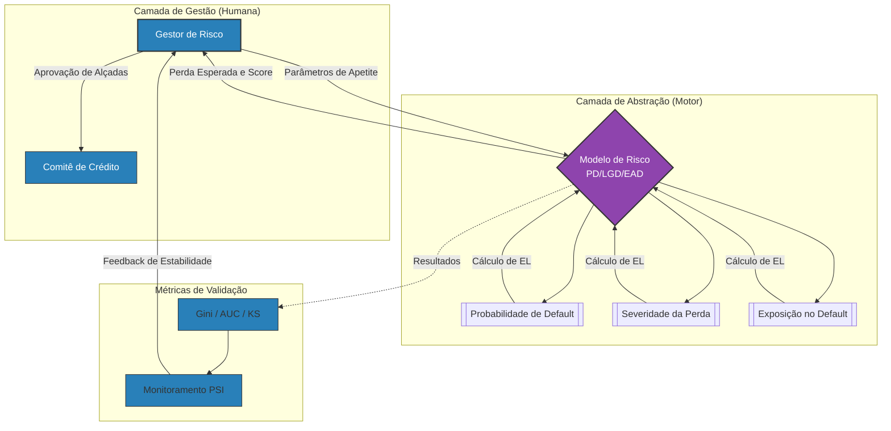

**>Início<** | [Workflow Corporativo](./workflow_corporativo.md) | [Portfólio](#) | [Dicionário](#) | [Contato](mailto:ralfpiredda@gmail.com)
___

# Ralf Pereira

 

___

| — | Portfólio Profissional | — |
|--|--|--|

Os projetos apresentados neste portfólio são estudos de caso fictícios, baseados em situações reais vivenciadas no ambiente corporativo. As funcionalidades e os cenários descritos têm caráter ilustrativo e buscam reproduzir contextos organizacionais realistas.

Para uma melhor compreensão da estrutura e da proposta dos projetos, recomenda-se a leitura — disponível no menu superior e na seção abaixo — dos documentos conceituais sobre `"Workflow Corporativo"` e `"Modelo de Demandas Orientado à Decisão"`.

---

Como Funciona um Fluxo Corporativo de Demandas [Acessar](https://github.com/Pireddas/pireddas/blob/main/workflow_corporativo.md)  
>Detalhamento de como uma demanda surge dentro de uma empresa e se transforma em um projeto de desenvolvimento...

Modelo de Gestão Assistida com Suporte de IA [Acessar](https://github.com/Pireddas/pireddas/blob/main/modelo_decisorio_assistido.md)
>Modelo decisório assistido é um modelo de trabalho em que atividades tradicionais de análise, estruturação e documentação de demandas passam a ser realizadas com suporte direto de Inteligência Artificial...

---

#  - Projetos -

 

| — | 1 - Solução para Comparação de Ativos Financeiros | — |
|--|--|--|

  

 

 

Este projeto apresenta uma **solução estruturada para comparação de ativos financeiros**, desenvolvida com foco em **padronização analítica, reprodutibilidade e apoio à decisão**.

O projeto demonstra como uma análise aparentemente simples pode ser tratada como um **produto analítico**, com separação clara entre **necessidade de negócio**, **requisitos**, **qualidade de software** e **evolução incremental**.

 

[Acessar Apresentação do Projeto](https://pireddas.github.io/proj_compara_ativos/apresentacao/) | [Acessar Repositório do Projeto](https://github.com/Pireddas/proj_compara_ativos)

---

 

| — | 2 - Solução para Enquadramento, Decisão e Gestão de Crédito   | — |
|--|--|--|

 

 

Este projeto apresenta uma **solução estruturada para o ciclo de concessão e renegociação de crédito**, desenvolvida com foco em **padronização de processos, flexibilidade decisória e evolução progressiva de inteligência**.

Inicialmente, a solução concentra-se no **enquadramento de propostas por workflow de alçadas**, garantindo aplicação consistente de políticas de crédito e rastreabilidade das decisões. A partir dessa base, o projeto evolui para um **motor de decisão parametrizável**, capaz de realizar **deferimentos automáticos** com base em **score contínuo**, substituindo gradualmente regras fixas por avaliações caso a caso.

Em etapas posteriores, a solução incorpora **mecanismos de inteligência analítica e IA** para apoio à identificação de riscos, culminando em uma camada superior de **monitoramento e gestão de carteira de crédito**. Nessa fase, a decisão individual passa a ser influenciada por **cenários econômicos, métricas de risco, alocação de capital, custo de capital, VaR, níveis de confiança e precificação**, conectando a operação diária à gestão estratégica de risco.

A solução, além de padronizar os processos operacionais das equipes comerciais, é concebido como um **ecossistema de decisão de crédito**, no qual cada camada evolutiva — **workflow, motor de decisão, inteligência analítica, monitoramento de carteira e gestão de risco** — substitui estruturas estáticas por um ciclo contínuo de adaptação às condições de mercado.

 

[Acessar Apresentação do Projeto](#) | [Acessar Repositório do Projeto](#)

---

 

| — | 3 - Solução para Gestão de Portfólio de Investimentos     | — |
|--|--|--|

 

 

Este projeto apresenta uma **solução estruturada para gestão de portfólio de investimentos**, com foco em **alocação eficiente de capital, controle de risco agregado e tomada de decisão sob cenários econômicos**.

A solução parte do consumo direto das **capacidades analíticas desenvolvidas no projeto _Solução para Comparação de Ativos Financeiros_**, reutilizando métricas padronizadas, análises de comportamento e estatísticas avançadas como **insumos fundamentais** para decisões em nível de carteira.

Além de uma evolução analítica, o projeto acrescenta uma **camada decisória superior**, responsável por transformar análises de ativos em **estratégias de alocação, rebalanceamento e gestão contínua**, considerando **restrições de risco, limites operacionais, custo de capital, VaR, níveis de confiança e precificação**.

A solução também incorpora **avaliação de cenários econômicos e monitoramento contínuo da carteira**, permitindo ajustes dinâmicos ao longo do tempo e conectando decisões individuais à **governança global do portfólio**.

Assim, o projeto consolida um **ecossistema de decisão em investimentos**, no qual a análise de ativos (Projeto 1) sustenta a gestão estratégica de carteiras, mantendo **clareza de responsabilidades, escalabilidade e evolução incremental**.

 

[Acessar Apresentação do Projeto](#) | [Acessar Repositório do Projeto](#)

---

 

| — | 4 - Ecossistema de Modelagem e Gestão de Risco de Crédito (Basileia II)  | — |
|--|--|--|

 

 

Este projeto é a **extensão lógica e técnica** da [Solução para Enquadramento e Gestão de Crédito (Projeto 2)](#). Enquanto o estágio anterior consolidou o *workflow* e a governança, este framework materializa a camada de **Inteligência Analítica** e o rigor estatístico necessário para sustentar decisões baseadas em risco real.

Ao estabelecer um **framework analítico de ponta a ponta para a gestão de risco de crédito** — fundamentado nos pilares do acordo de **Basileia II** —, a solução não apenas permite a automação de políticas, mas principalmente a estruturação de uma arquitetura de decisão baseada no cálculo da **Perda Esperada ($EL$)**.

A solução utiliza **Regressão Logística e Linear** para instanciar três componentes críticos de decisão (**Personas Analíticas**):

* **PD (Probability of Default):** Modelagem de probabilidade de inadimplência através de técnicas de *Weight of Evidence (WoE)* e *Information Value (IV)*, resultando em um **Scorecard** funcional para definição de *cut-offs*.
* **LGD (Loss Given Default):** Estimativa da severidade da perda em caso de default, utilizando uma abordagem em dois estágios (Regressão Logística + Regressão Linear).
* **EAD (Exposure at Default):** Cálculo da exposição no momento da falha, considerando fatores de conversão de crédito.

O diferencial deste projeto é a sua **Camada de Abstração Estratégica**: em vez de regras estáticas de enquadramento, a gestão passa a ser orientada pelo impacto direto no **Capital Regulatório** e pela validação contínua via **PSI (Population Stability Index)** e métricas de performance (**Gini, AUROC e KS**). O sistema permite que o gestor atue como um orquestrador de risco, ajustando o apetite de crédito com base em evidências estatísticas e cenários de alocação de capital (Abordagens SA, F-IRB e A-IRB).

Ao integrar o processamento de dados em Python com a visão de gestão de carteira, o projeto entrega uma ferramenta de **apoio à decisão consciente**, onde a incerteza é quantificada e o risco é precificado de forma dinâmica.

---

 

| — | Arquitetura de Decisão (Modelo de Abstração)    | — |
|--|--|--|

 

[Acessar Apresentação do Projeto](#) | [Acessar Repositório do Projeto](#)

---

 
 

