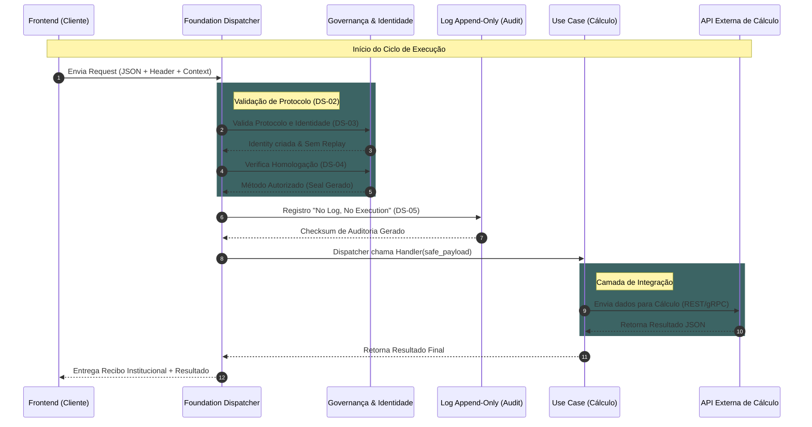
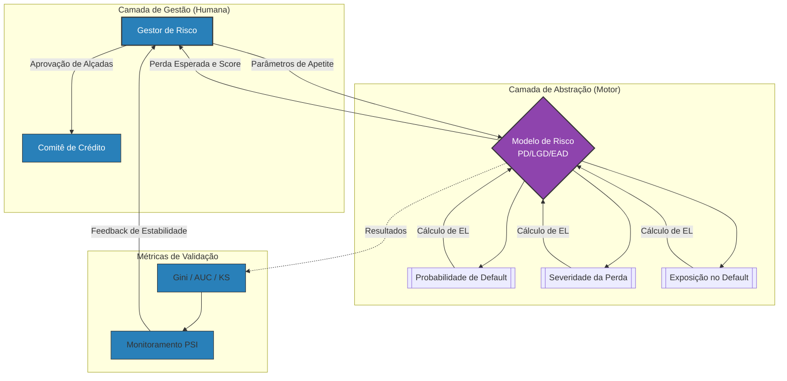
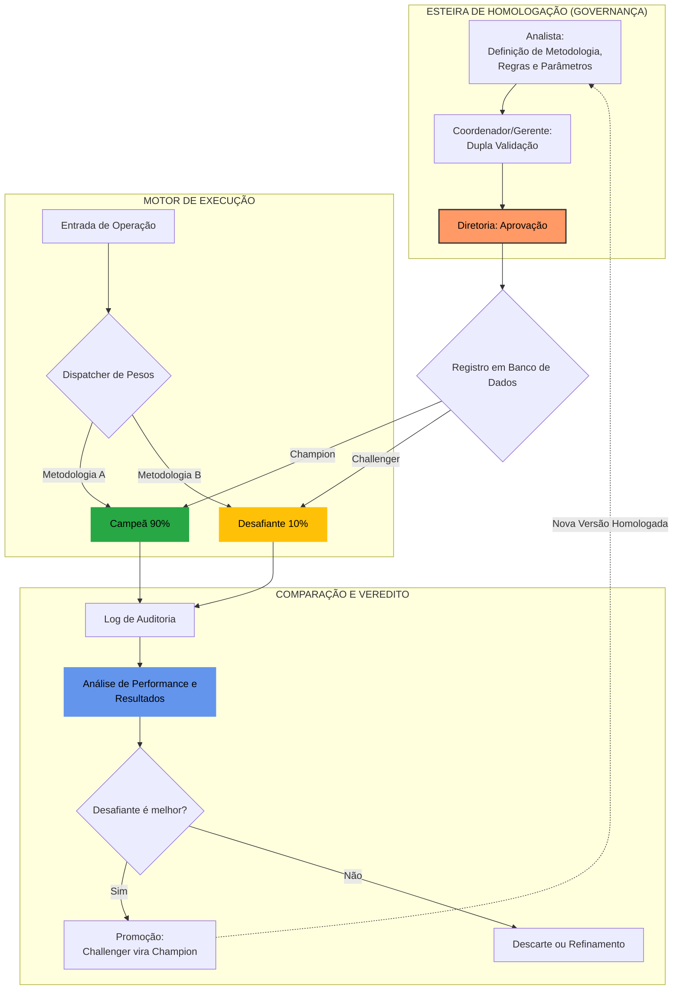

**>Início<** | [Publicações](./publicacoes.md) | [Portfólio](#) | [Repositórios](https://github.com/Pireddas?tab=repositories) | [Contato](mailto:ralfpiredda@gmail.com)
___

    <h1>
        Ralf Pereira    
    </h1>

 

 

___

    <h1>Pesquisa e Desenvolvimento</h1>

Este portfólio funciona como um **ambiente de experimentação e validação** entre dois modelos:

1. **A Gestão Padrão (Vivida):** Estruturas consolidadas de governança e workflow consolidado.
2. **A Gestão Assistida (Tese):** Uma proposta de inovação que integra IA como `Personas` para suporte à decisão, atualmente em fase de testagem através destes projetos.

Os projetos apresentados neste portfólio são estudos de caso fictícios, baseados em situações reais vivenciadas no ambiente corporativo. As funcionalidades e os cenários descritos têm caráter ilustrativo e buscam reproduzir contextos organizacionais realistas.

Para uma melhor compreensão da estrutura e da proposta dos projetos, recomenda-se a leitura — disponível no menu superior e na seção abaixo — dos documentos conceituais sobre `"Workflow Corporativo"` e `"Modelo de Demandas Orientado à Decisão"`.

 

---

    <h1>Publicações, Papers e Artigos</h1>

Aqui apresento estudos e frameworks focados na evolução da gestão e na eficiência operacional.

# 

### 📄 Fluxo Corporativo de Demandas
**Tipo:** Baseline Metodológico  

> **Contexto:** Um mapeamento detalhado do cenário tradicional (As-Is). Este paper analisa o ciclo de vida de uma demanda, desde o gatilho inicial até a execução, destacando os pontos críticos de decisão e os gargalos de compreensão reativa.

**[Ler na íntegra →](https://github.com/Pireddas/pireddas/blob/main/workflow_corporativo.md)**

# 

### 📄 Modelo de Gestão Assistida com Suporte de IA
**Tipo:** Proposta de Framework (To-Be)

> **Contexto:** Uma evolução do modelo tradicional. Este artigo propõe a utilização da IA como uma Camada de Abstração Cognitiva, permitindo que a gestão opere em níveis mais altos de estratégia através da instanciação de personas especialistas.

**[Ler na íntegra →](https://github.com/Pireddas/pireddas/blob/main/modelo_decisorio_assistido.md)**

 

---

    <h1>Portfólio de Projetos</h1>

 

    <h2>
        1 - Solução para Comparação de Ativos Financeiros
    </h2>

  

 

 

Este projeto apresenta uma **solução estruturada para comparação de ativos financeiros**, desenvolvida com foco em **padronização analítica, reprodutibilidade e apoio à decisão**.

O projeto demonstra como uma análise aparentemente simples pode ser tratada como um **produto analítico**, com separação clara entre **necessidade de negócio**, **requisitos**, **qualidade de software** e **evolução incremental**.

 

    <h3>1.1 - Arquitetura de Governança Ativa</h3>

```mermaid
sequenceDiagram
    autonumber
    participant Front as Frontend (Cliente)
    participant Disp as Foundation Dispatcher
    participant Gov as Governança & Identidade
    participant Log as Log Append-Only (Audit)
    participant UC as Use Case (Cálculo)
    participant API as API Externa de Cálculo

    Note over Front, API: Início do Ciclo de Execução

    Front->>Disp: Envia Request (JSON + Header + Context)
    
    rect rgb(60, 100, 100)
        Note right of Disp: Validação de Protocolo (DS-02)
        Disp->>Gov: Valida Protocolo e Identidade (DS-03)
        Gov-->>Disp: Identity criada & Sem Replay
        
        Disp->>Gov: Verifica Homologação (DS-04)
        Gov-->>Disp: Método Autorizado (Seal Gerado)
    end

    Disp->>Log: Registro "No Log, No Execution" (DS-05)
    Log-->>Disp: Checksum de Auditoria Gerado

    Disp->>UC: Dispatcher chama Handler(safe_payload)
    
    rect rgb(60, 100, 100)
        Note right of UC: Camada de Integração
        UC->>API: Envia dados para Cálculo (REST/gRPC)
        API-->>UC: Retorna Resultado JSON
    end

    UC-->>Disp: Retorna Resultado Final
    Disp-->>Front: Entrega Recibo Institucional + Resultado

```
 

[Acessar Apresentação do Projeto](https://pireddas.github.io/proj_compara_ativos/apresentacao/) | [Acessar Repositório do Projeto](https://github.com/Pireddas/cc_engine_v2)

# 

 

    <h2>
        2 - Solução para Enquadramento, Decisão e Gestão de Crédito
    </h2>

 

 

Este projeto apresenta uma **solução estruturada para o ciclo de concessão e renegociação de crédito**, desenvolvida com foco em **padronização de processos, flexibilidade decisória e evolução progressiva de inteligência**.

Inicialmente, a solução concentra-se no **enquadramento de propostas por workflow de alçadas**, garantindo aplicação consistente de políticas de crédito e rastreabilidade das decisões. A partir dessa base, o projeto evolui para um **motor de decisão parametrizável**, capaz de realizar **deferimentos automáticos** com base em **score contínuo**, substituindo gradualmente regras fixas por avaliações caso a caso.

Em etapas posteriores, a solução incorpora **mecanismos de inteligência analítica e IA** para apoio à identificação de riscos, culminando em uma camada superior de **monitoramento e gestão de carteira de crédito**. Nessa fase, a decisão individual passa a ser influenciada por **cenários econômicos, métricas de risco, alocação de capital, custo de capital, VaR, níveis de confiança e precificação**, conectando a operação diária à gestão estratégica de risco.

A solução, além de padronizar os processos operacionais das equipes comerciais, é concebido como um **ecossistema de decisão de crédito**, no qual cada camada evolutiva — **workflow, motor de decisão, inteligência analítica, monitoramento de carteira e gestão de risco** — substitui estruturas estáticas por um ciclo contínuo de adaptação às condições de mercado.

 

[Acessar Apresentação do Projeto](#) | [Acessar Repositório do Projeto](#)

# 

 

    <h2>
        3 - Solução para Gestão de Portfólio de Investimentos
    </h2>

 

 

Este projeto apresenta uma **solução estruturada para gestão de portfólio de investimentos**, com foco em **alocação eficiente de capital, controle de risco agregado e tomada de decisão sob cenários econômicos**.

A solução parte do consumo direto das **capacidades analíticas desenvolvidas no projeto _Solução para Comparação de Ativos Financeiros_**, reutilizando métricas padronizadas, análises de comportamento e estatísticas avançadas como **insumos fundamentais** para decisões em nível de carteira.

Além de uma evolução analítica, o projeto acrescenta uma **camada decisória superior**, responsável por transformar análises de ativos em **estratégias de alocação, rebalanceamento e gestão contínua**, considerando **restrições de risco, limites operacionais, custo de capital, VaR, níveis de confiança e precificação**.

A solução também incorpora **avaliação de cenários econômicos e monitoramento contínuo da carteira**, permitindo ajustes dinâmicos ao longo do tempo e conectando decisões individuais à **governança global do portfólio**.

Assim, o projeto consolida um **ecossistema de decisão em investimentos**, no qual a análise de ativos (Projeto 1) sustenta a gestão estratégica de carteiras, mantendo **clareza de responsabilidades, escalabilidade e evolução incremental**.

 

[Acessar Apresentação do Projeto](#) | [Acessar Repositório do Projeto](#)

# 

 

    <h2>
        4 - Ecossistema de Modelagem e Gestão de Risco de Crédito (Basileia II)
    </h2>

 

 

Este projeto é a **extensão lógica e técnica** da [Solução para Enquadramento e Gestão de Crédito (Projeto 2)](#). Enquanto o estágio anterior consolidou o *workflow* e a governança, este framework constitui a camada de **Inteligência Analítica** e o rigor estatístico necessário para sustentar decisões baseadas em risco real.

Ao estabelecer um **framework analítico de ponta a ponta para a gestão de risco de crédito** — fundamentado nos pilares do acordo de **Basileia II** —, a solução permite a automação de políticas e a estruturação de uma arquitetura de decisão baseada no cálculo da **Perda Esperada ($EL$)**.

$$EL = PD \times LGD \times EAD$$

A solução utiliza **Regressão Logística e Linear** para instanciar três componentes críticos de decisão (**Personas Analíticas**):

* **PD (Probability of Default):** Modelagem de probabilidade de inadimplência através de técnicas de *Weight of Evidence (WoE)* e *Information Value (IV)*, resultando em um **Scorecard** funcional para definição de *cut-offs*.
* **LGD (Loss Given Default):** Estimativa da severidade da perda em caso de default, utilizando uma abordagem em dois estágios (Regressão Logística + Regressão Linear).
* **EAD (Exposure at Default):** Cálculo da exposição no momento da falha, considerando fatores de conversão de crédito.

O diferencial deste projeto é a sua **Camada de Abstração Estratégica**: em vez de regras estáticas de enquadramento, a gestão passa a ser orientada pelo impacto direto no **Capital Regulatório** e pela validação contínua via **PSI (Population Stability Index)** e métricas de performance (**Gini, AUROC e KS**). O sistema permite que o gestor atue como um orquestrador de risco, ajustando o apetite de crédito com base em evidências estatísticas e cenários de alocação de capital (Abordagens SA, F-IRB e A-IRB).

Ao integrar o processamento de dados em Python com a visão de gestão de carteira, o projeto entrega uma ferramenta de **apoio à decisão consciente**, onde a incerteza é quantificada e o risco é precificado de forma dinâmica.

 

    <h3>
        4.1 - Arquitetura de Decisão (Modelo de Abstração)
    </h2>

```mermaid
graph TD
    subgraph "Camada de Gestão (Humana)"
        GE[Gestor de Risco]
        CO[Comitê de Crédito]
    end

    subgraph "Camada de Abstração (Motor)"
        IA{Modelo de Risco<br>PD/LGD/EAD}
        PD[[Probabilidade de Default]]
        LGD[[Severidade da Perda]]
        EAD[[Exposição no Default]]
    end

    subgraph "Métricas de Validação"
        V[Gini / AUC / KS]
        M[Monitoramento PSI]
    end

    %% Fluxo de Cálculo
    GE -->|Parâmetros de Apetite| IA
    IA --> PD
    IA --> LGD
    IA --> EAD
    
    PD & LGD & EAD -->|Cálculo de EL| IA
    IA -->|Perda Esperada e Score| GE

    %% Fluxo de Governança
    IA -.->|Resultados| V
    V --> M
    M -->|Feedback de Estabilidade| GE
    GE -->|Aprovação de Alçadas| CO

    %% Estilização
    style IA fill:#8e44ad,stroke:#333,stroke-width:2px,color:#fff
    style GE fill:#2980b9,stroke:#333,stroke-width:2px,color:#fff
    style CO fill:#2980b9,stroke:#333,stroke-width:1px,color:#fff
    style V fill:#2980b9,stroke:#333,stroke-width:1px
    style M fill:#2980b9,stroke:#333,stroke-width:1px
```

 

[Acessar Apresentação do Projeto](#) | [Acessar Repositório do Projeto](#)

 

    <h2>
        5 - Framework de Governança de Regras, Parâmetros e Metodologias
    </h2>

 

 

Este projeto apresenta uma infraestrutura de backend de alta confiabilidade, desenvolvida para atuar como o núcleo de governança e auditoria de regras de negócio. A solução resolve o desafio crítico de garantir que regras, parâmetros, cálculos e metodologias sejam plenamente rastreáveis, imutáveis e vinculados a alçadas de decisão explícitas.

A arquitetura introduz o conceito de Soberania de Dados, onde cada transação é precedida por um protocolo de identidade e selagem institucional. Diferente de sistemas convencionais onde as regras de cálculo estão "escondidas" no código-fonte, este framework as trata como ativos de governança armazenados em banco de dados, com gestão de vigência, versões e metodologias explícitas.

A solução implementa uma Máquina de Estados para Ciclo de Vida de Regras, Parâmetros, Cálculos e Metodologias, permitindo estratégias de Champion-Challenger e A/B Testing de metodologias. Neste modelo, uma regra nunca expira por data, mas é substituída por uma nova versão aprovada, gerando um histórico de transição de status (ex: Draft → Challenger → Champion → Deprecated) que permite a reconstituição exata de qualquer cálculo realizado no passado, independente de quantas evoluções o sistema tenha sofrido.

Além do rigor normativo, o projeto incorpora uma camada de Observabilidade e Métricas de Performance, monitorando latências de execução em milissegundos e integridade de selos criptográficos em tempo real. Esta infraestrutura serve como a base para o Projeto 4 (Basileia II), garantindo que as fórmulas de risco (PD, LGD, EAD) estejam sob controle estrito de alçadas, e sustenta a confiabilidade do Projeto 3 (Gestão de Portfólio) ao assegurar que os parâmetros de risco (VaR e limites) tenham sido formalmente autorizados pela gerência ou diretoria antes de influenciarem a alocação de capital.

Em suma, o projeto permite que a instituição evolua suas inteligências analíticas com total segurança jurídica e operacional.

 

    <h3>
        5.1 - Governança de Modelos
    </h2>

```mermaid
graph TD
    %% Camada de Alçadas e Aprovação
    subgraph Alçadas ["ESTEIRA DE HOMOLOGAÇÃO (GOVERNANÇA)"]
        A[Analista:<br/>Definição de Metodologia,<br>Regras e Parâmetros] --> B[Coordenador/Gerente:<br/>Dupla Validação]
        B --> C[Diretoria: Aprovação]
    end

    %% Registro e Estados
    C --> D{Registro em Banco de Dados}
    D -->|Champion| E[Campeã 90%]
    D -->|Challenger| F[Desafiante 10%]

    %% Camada de Execução (Dispatcher)
    subgraph Execucao ["MOTOR DE EXECUÇÃO"]
        G[Entrada de Operação] --> H{Dispatcher de Pesos}
        H -->|Metodologia A| E
        H -->|Metodologia B| F
    end

    %% Auditoria e Resultados
    E --> I[Log de Auditoria]
    F --> I
    
    subgraph Analise ["COMPARAÇÃO E VEREDITO"]
        I --> J[Análise de Performance e<br/>Resultados]
        J --> K{Desafiante é melhor?}
        K -->|Sim| L[Promoção:<br/>Challenger vira Champion]
        K -->|Não| M[Descarte ou Refinamento]
    end

    %% Retroalimentação
    L -.->|Nova Versão Homologada| A

    %% Estilização
    style C fill:#f96,stroke:#333,stroke-width:2px,color:#000
    style E fill:#28a745,stroke:#28a745,stroke-width:2px,color:#000
    style F fill:#ffc107,stroke:#ffc107,stroke-width:2px,color:#000
    style J fill:#6495ED,stroke:#6495ED,stroke-width:2px,color:#000

```

[Acessar Apresentação do Projeto](#) | [Acessar Repositório do Projeto](#)

---

 

