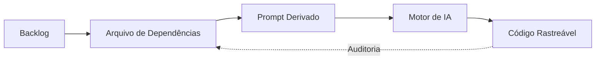

# 📓 Log de Pesquisa #005: O Backlog como Orquestrador de Contexto

**Data:** 08/01/2026  
**Status:** 🔴 Gatilho Ativo (Prioridade Alta)  
**Tópico:** Desenvolvimento Assistido por IA e Engenharia de Contexto Rígida  
**Gatilho para:** [Artigo: O Prompt como Artefato Técnico Formal] | [Paper: Framework de Governança na Codificação Assistida]

---

# Diário de Pesquisa — Insights & Gatilhos  
## Tema: Desenvolvimento Assistido por IA com Rastreabilidade Total

### Contexto
Discussão sobre estruturação de projetos, documentação orientada a rastreabilidade e uso de IA como desenvolvedor assistido e supervisionado, a partir de um framework rígido de negócio → funcional → técnico → testes.

O foco do insight foi tornar **possível o desenvolvimento componente a componente por IA**, sem perda de coerência arquitetural, sem acoplamento indevido e sem dependência implícita de contexto humano.

---

## Insight Central

O desenvolvimento assistido por IA **só funciona bem quando a IA recebe um recorte completo e autocontido de contexto**.

Não basta dizer *“implemente o componente X”*.  
A IA precisa receber:
- **o que é**
- **por que existe**
- **onde se encaixa**
- **quais regras deve obedecer**
- **com quem conversa**
- **quais decisões já foram tomadas**

Sem isso, a IA tende a:
- reinventar conceitos
- criar componentes que não conversam
- violar decisões arquiteturais já documentadas

---

## Gatilho 1 — Backlog não é código, nem prompt

Percepção-chave:
> Um item de backlog **não é um componente**  
> e **não é um prompt executável**.

Um item de backlog representa:
- uma entrega de valor
- que depende de **vários componentes**
- em **níveis diferentes de dependência**
- com regras espalhadas em vários documentos

Portanto:
- backlog **orquestra**
- componentes **implementam**
- prompts **executam**

Misturar esses níveis gera caos.

---

## Gatilho 2 — Surge o artefato intermediário: Dependências do Backlog

Insight estrutural decisivo:

Não existe:
> “um arquivo de prompt por backlog”

Existe:
> **um arquivo de dependências do backlog**, que gera prompts seguros.

Esse arquivo **não substitui nenhum documento existente**.  
Ele **costura todos eles**.

---

## Estrutura do Arquivo de Dependências do Backlog

Cada item do backlog possui **uma seção própria** nesse arquivo.

### Exemplo de estrutura lógica:

**Item de Backlog**
- ID: BL-03
- Nome: Comparação de risco entre ativos

**Item Técnico**
- ID: COMP-RISK-01
- Descrição: Componente para cálculo de métricas de risco

**Referências Obrigatórias**
- Regras funcionais: `RF-03`, `RF-04`
- Histórias: `US-02`
- Critérios de aceite: `CA-02`
- Visão de arquitetura (Nível 1): `visao_de_solucao_tecnica_nivel_1.md`
- Visão de componentes (Nível 2): `visao_de_solucao_tecnica_nivel_2.md`
- ADRs aplicáveis: `ADR-002`
- Domínio de código: `src/domain`
- Services envolvidos: `src/services`
- Testes esperados: `testes_unitarios_previstos.md`

**Nível de Dependência**
- Nível 1 — crítico para a entrega
- Nível 2 — suporte
- Nível 3 — integração futura

---

## Gatilho 3 — O Prompt vira um artefato técnico formal

O prompt **não é texto solto**.  
Ele é um **extrato técnico executável**, derivado do arquivo de dependências.

### Estrutura do Prompt

- Contexto funcional (o que o componente faz)
- Regras explícitas (fórmulas, limites, validações)
- Restrições arquiteturais
- Interfaces esperadas
- Localização do código
- Referência clara aos documentos-fonte

Exemplo conceitual de comando ao Cursor:

> “Desenvolver o componente `COMP-RISK-01`, conforme descrito neste extrato,  
> respeitando as regras funcionais RF-03 e RF-04,  
> a arquitetura definida no nível 1,  
> os contratos do nível 2,  
> e os critérios de aceite CA-02.”

A IA **não decide o que fazer**.  
Ela **executa o que já foi decidido**.

---

## Insight Técnico — Por que isso funciona

Esse modelo permite que a IA:

- implemente componentes **isoladamente**
- sem quebrar o domínio
- sem inventar contratos
- sem violar decisões arquiteturais
- sem depender de memória implícita de contexto

Mesmo um código como:

```python
def calcular_volatilidade(serie: SeriePreco) -> float:
```

---


---

>O código — gerado por IA — é a consequência causal das dependências documentais.

---
**Autor:** Ralf Pereira  
**Data:** 08 de janeiro de 2026  
**Nota:** Este insight integra a tese de *Desenvolvimento Assistido por IA com Rastreabilidade Total*.


    
