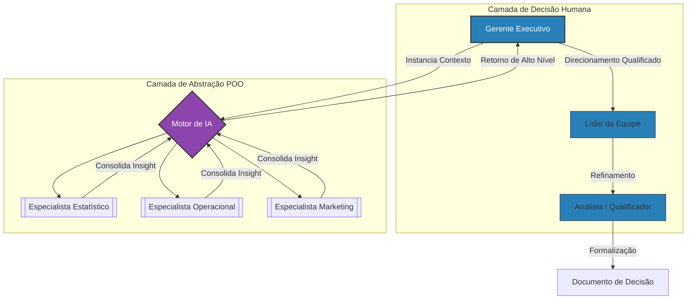
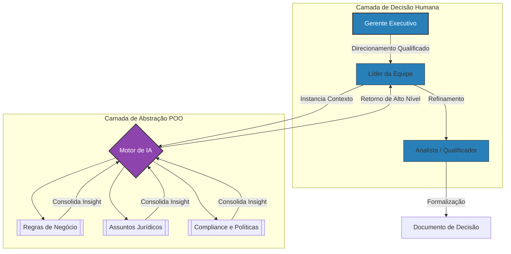
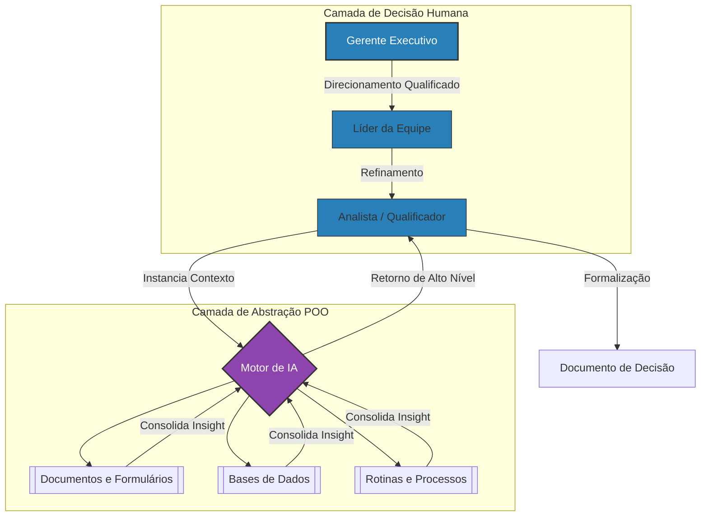

[← Voltar para a Home](https://github.com/Pireddas) | [Fluxo Corporativo de Demandas](./workflow_corporativo.md) | **>Modelo de Demandas Orientado à Decisão<**
___

# Modelo de Gestão Assistida com Suporte de IA

Este documento descreve um modelo de trabalho em que atividades tradicionais de análise, estruturação e documentação de demandas passam a ser realizadas com suporte direto de Inteligência Artificial, mantendo o workflow corporativo vigente, suas alçadas, responsabilidades e pontos de decisão.

O objetivo não é alterar o processo organizacional, mas **elevar o nível de abstração cognitiva** com que esse processo é executado.

Essa interação permite a **Instanciação de Personas Especialistas**: o gerente pode simular a presença de múltiplos perfis técnicos simultaneamente (ex: um Analista de Riscos, um Cientista de Dados e um Especialista em Marketing). A IA atua como uma **Camada de Abstração (Facade)**, processando a complexidade técnica e entregando ao gerente os pontos críticos para a tomada de decisão antes mesmo da primeira reunião humana.

---

## Compreensão Antes da Interação Humana

No modelo tradicional, quando um Gerente Executivo recebe uma demanda, a compreensão das possibilidades costuma ocorrer por meio de:

- Conversas exploratórias com líderes e especialistas
- Solicitação de estudos e análises
- Espera por relatórios e documentos intermediários
- Construção gradual de entendimento ao longo do tempo

Neste modelo, esse primeiro momento de compreensão pode ocorrer **antes da interação humana**, por meio de uma interação direta entre o gerente e a IA.

Essa interação não tem caráter decisório final, mas exploratório e estruturante.

---

## A Interação do Gerente Executivo com a IA

Ao receber um gatilho de demanda, o Gerente Executivo pode utilizar a IA para:

- Explorar práticas consolidadas de mercado
- Avaliar modelos e abordagens conhecidas para problemas semelhantes
- Compreender métodos aplicáveis (estatísticos, matemáticos, operacionais ou organizacionais)
- Simular cenários e alternativas de solução
- Identificar vantagens, limitações e impactos de cada abordagem

Essa interação funciona, na prática, como uma **reunião de exploração cognitiva**, onde o gerente constrói entendimento sobre possibilidades que não domina integralmente ou que demandariam alto esforço humano para serem pesquisadas.

O resultado dessa etapa não é uma decisão final, mas um **direcionamento muito mais qualificado**.

---

## Direcionamento da Demanda com Base em Entendimento Amplo

Ao iniciar a conversa com o Líder da equipe, o gerente já possui:

- Clareza sobre alternativas possíveis
- Referências de modelos bem-sucedidos
- Linguagem comum para discutir soluções
- Critérios mais objetivos para orientar ajustes

Esse direcionamento pode ser formalizado pela própria IA, a partir da interação com o gerente, gerando documentos iniciais que expressam:

- O entendimento do problema
- As alternativas consideradas
- As premissas adotadas
- Os objetivos esperados

Esses artefatos passam a ser o ponto de partida do alinhamento com a liderança.

Este processo resulta na redução drástica dos **"Unknown Unknowns"** (aquilo que a gestão nem sabe que não sabe). Ao antecipar dependências que normalmente só apareceriam após meses de discussão, o gerente assume o papel de um orquestrador que já possui o mapa das incertezas críticas desenhado, transformando reuniões de "descoberta básica" em reuniões de **"validação e decisão"**.

---

---

## Atuação do Líder com Suporte da IA

O Líder da equipe, ao receber essa documentação inicial:

- Não começa do zero
- Não depende apenas de interpretação subjetiva
- Tem acesso ao racional que originou o direcionamento

A partir disso, o líder pode utilizar a IA para:

- Refinar o entendimento técnico ou operacional
- Avaliar viabilidade no contexto da equipe
- Ajustar escopo e abordagem
- Preparar o material necessário para a próxima etapa do workflow

---

A IA passa a apoiar também a **reunião de alinhamento**, estruturando informações, registrando decisões e mantendo rastreabilidade.

---

## O Papel do Analista (Negócio, BI, Requisitos e Áreas Correlatas) na Formalização e Qualificação das Decisões

O uso de IA no processo de construção de demandas não elimina a atuação de Analistas de Negócios, BI, Requisitos ou funções equivalentes. Ele redefine o foco da atuação desses profissionais.

No modelo tradicional, grande parte do esforço do analista está associada à coleta de informações, à consolidação de entendimentos dispersos e à produção de documentos a partir de múltiplas interações humanas.

Neste modelo, o analista passa a atuar sobre uma base de conhecimento já estruturada, construída a partir da interação entre liderança e IA, que inclui:
- Direcionamento estratégico explícito
- Alternativas de solução consideradas
- Premissas adotadas
- Racional das decisões iniciais
- Materiais e registros rastreáveis das etapas anteriores

A partir dessa base, o papel do analista se concentra em atividades de maior valor cognitivo, como:
- Avaliar a coerência entre problema, solução proposta e objetivos do negócio
- Identificar lacunas, inconsistências ou riscos não evidentes
- Refinar requisitos e regras de negócio com foco em impacto
- Garantir clareza, precisão e rastreabilidade na documentação formal
- Apoiar ajustes necessários antes das decisões finais

A interação do analista com a IA ocorre como um meio de:
- Alinhar alternativas e cenários
- Redigir documentos formais de forma consistente
- Manter conexão explícita entre decisões, análises e artefatos produzidos

A documentação deixa de ser um exercício de descoberta ou tradução e passa a ser um processo de **formalização qualificada**, orientado à decisão e ao impacto no negócio.

Nesse contexto, o analista atua como um **qualificador da decisão**, garantindo que aquilo que foi compreendido, direcionado e aprovado esteja corretamente representado nos artefatos que sustentam o workflow corporativo.

---

---

## Processo Aplicado à Decisão Estratégica de Negócio

Com esse modelo, atividades antes concentradas em funções gerenciais passam a fazer parte da atuação de todos os envolvidos no processo:

- Explorar possibilidades
- Entender modelos e métodos não dominados
- Avaliar alternativas com base em dados e práticas consolidadas
- Direcionar, ajustar e decidir

A IA assume o papel de **consumir esforço cognitivo pesado** relacionado à busca, comparação, estruturação e redação inicial.

Os profissionais passam a concentrar seu tempo em:

- Compreender o que está sendo produzido
- Avaliar aderência ao negócio
- Solicitar ajustes
- Tomar decisões dentro de suas responsabilidades

---

## Continuidade do Workflow com Maior Abstração

O workflow corporativo permanece o mesmo:
- As etapas continuam existindo
- As alçadas continuam válidas
- As responsabilidades permanecem claras

O que muda é o nível de abstração com que o processo é executado.

A construção de entendimento se torna mais profunda.
A qualidade do direcionamento aumenta.
A eficiência cognitiva se eleva de forma significativa.

O processo deixa de ser orientado à produção de artefatos e passa a ser **orientado à decisão, entendimento e impacto**.

  

---
**Autor:** Ralf Pereira  
**Tópico:** Framework de Gestão Assistida por IA  
**Status:** Modelo em Validação (Tese)  

> *Este framework está sendo testado e refinado através dos estudos de caso apresentados no meu [Portfólio Profissional](https://github.com/Pireddas).*
