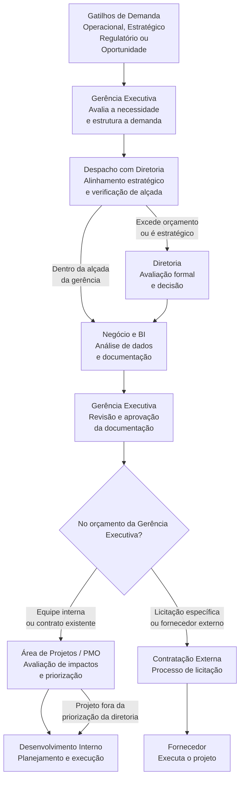

[← Voltar para o README](./README.md) | 

# Do Problema Estratégico ao Desenvolvimento: Como Funciona um Fluxo Corporativo de Demandas

Este documento descreve, de forma simples, como uma demanda surge dentro de uma empresa e se transforma em um projeto de desenvolvimento.  
O objetivo é ajudar leitores sem experiência corporativa a entender **quem participa**, **o que acontece em cada etapa** e **como as decisões são estruturadas ao longo do processo**.

---

## Visão Geral

Em empresas médias e grandes, ideias **não seguem diretamente para o desenvolvimento**.  
Elas percorrem um fluxo estruturado que permite:

- Compreender o problema ou oportunidade
- Avaliar impacto e viabilidade
- Alinhar diferentes áreas da organização
- Definir responsabilidades e decisões
- Organizar prioridades e execução

Esse fluxo envolve múltiplas áreas e diferentes níveis hierárquicos.

---

## Visão Simplificada do Fluxo

1. Uma demanda é identificada a partir de diferentes gatilhos  
2. A gerência executiva estrutura a demanda  
3. O negócio analisa dados e documenta a necessidade  
4. A gerência revisa e aprova a documentação  
5. A área de projetos avalia impactos e viabilidade  
6. A demanda pode ou não passar por priorização da diretoria, conforme a alçada  
7. O desenvolvimento é planejado e executado  

---

## Etapa 1: Origem da Demanda

### O que acontece?
Uma demanda pode surgir a partir de diferentes contextos, como:
- Necessidades operacionais
- Oportunidades de melhoria
- Exigências regulatórias
- Direcionamentos estratégicos

A origem pode estar em áreas operacionais, na gerência executiva ou na diretoria.

### Importante entender:
Neste momento, **ainda não existe um projeto**, apenas uma **necessidade identificada**.

---

## Etapa 2: Estruturação da Demanda (Gerência Executiva)

### O que acontece?
A gerência executiva:
- Analisa a demanda identificada
- Avalia sua relevância e escopo
- Inicia a estruturação formal

Ela normalmente envolve:
- O líder da área responsável
- Coordenadores
- Especialistas do negócio

### Objetivo:
Transformar uma necessidade inicial em uma demanda compreensível e estruturada.

---

## Etapa 3: Análise e Documentação (Negócio, BI e Coordenação)

### O que acontece?
Nesta fase são realizados:

- Levantamento de dados históricos
- Análise de indicadores
- Elaboração de relatórios
- Discussões sobre regras e requisitos de negócio

### Principais entregas:
- Descrição do problema ou oportunidade
- Requisitos de negócio
- Regras de negócio
- Escopo inicial
- Plano macro de entrega

Esse material é consolidado em **documentação formal**, utilizada nas etapas seguintes.

---

## Etapa 4: Revisão e Aprovação (Gerência Executiva)

### O que acontece?
A gerência executiva:
- Analisa a documentação produzida
- Solicita ajustes, quando necessário
- Confirma o entendimento da demanda
- Aprova formalmente o avanço

### Objetivo:
Assegurar que a demanda está corretamente representada antes de seguir no fluxo.

---

## Etapa 5: Avaliação pela Área de Projetos

### O que acontece?
A área de projetos (ou PMO) analisa a demanda sob a ótica de planejamento e execução.

Normalmente são avaliados:
- Impactos organizacionais
- Cenário atual (AS IS)
- Cenário futuro (TO BE)
- Custos estimados
- Dependências
- Modelo de execução
- Indicadores financeiros, quando aplicável

### Objetivo:
Preparar a demanda para decisão e execução, considerando padrões organizacionais.

---

## Etapa 6: Alinhamento e Priorização (Diretoria)

### O que acontece?
Existe sempre um momento de alinhamento com a diretoria para:
- Garantir aderência estratégica
- Verificar limites de alçada orçamentária
- Dar visibilidade executiva

Dependendo da alçada:
- A demanda pode entrar na priorização corporativa
- Ou seguir diretamente para execução, sob responsabilidade da gerência executiva

---

## Etapa 7: Desenvolvimento e Execução

### O que acontece?
Após as aprovações necessárias:
- O modelo de execução é definido
- Prazos e entregas são acordados
- O desenvolvimento é iniciado

A execução pode ocorrer por:
- Equipes internas
- Contratos existentes
- Processos de contratação ou licitação específicos

O modelo de trabalho pode variar entre:
- Tradicional (Waterfall)
- Ágil
- Híbrido

---

## Diagrama do Fluxo Corporativo de Demandas

O diagrama abaixo representa como demandas com diferentes origens percorrem a organização, considerando alinhamento executivo, limites de alçada e modelos de execução.

### Como Interpretar o Fluxo

- A demanda pode surgir em diferentes pontos da organização
- A gerência executiva atua como ponto central de estruturação
- Sempre existe um momento de alinhamento com a diretoria
- A diretoria nem sempre prioriza, mas sempre governa
- O caminho de execução depende:
  - Da alçada orçamentária
  - Do modelo de contratação
  - Da dependência (ou não) das equipes internas

